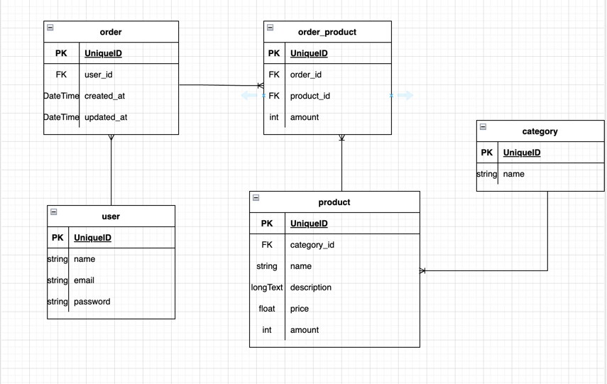

# Ecommerce database example using Symfony and Doctrine ORM

## Database structure


## Installing via Docker

Download this repository:<br>

``
git clone https://github.com/Underforestt/ecommerce-db-symfony.git 
``<br>

and move to project directory:<br>

``
cd ecommerce-db-symfony
``

Edit these environment variables for database service in ``./docker/docker-compose.yml``:

MYSQL_ROOT_PASSWORD: <your_root_password><br>
MYSQL_DATABASE: <your_db_name><br>
MYSQL_USER: <your_user><br>
MYSQL_PASSWORD: <your_password>

Then copy app/.env file in app/.env.local:<br>

``
cp app/.env app/.env.local
``<br>

Change database url in app/.env.local according to environment variables you set in ``./docker/docker-compose.yml``:<br>

``DATABASE_URL="mysql://root:<your_root_password>@database:3306/<your_db_name>?serverVersion=8.0"``

Now run ``make build`` and ``make up`` and you are done!

## Usage

At first let`s run migrations, for this enter bash shell inside PHP container:
``make bash``

Then run: ``php bin/console doctrine:migrations:migrate``, now database tables are created.

Let's fill them with fixture data: ``php bin/console doctrine:fixtures:load``, and that's it.

Now you can open mysql shell inside database container(``make db``) and execute some SQL commands, for example: 
```sql
select * from products;
```
:warning: When refer order table, put table name in ``, because order is reserved word in SQL
